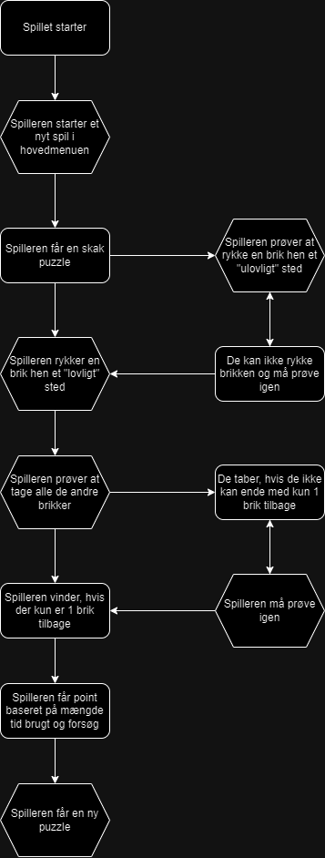

# Ches
Chess puzzle spil. Til HTX eksamen 2024

### Spillets handling
Hvordan fungerer spillet?

# Dokumentation af komponenter
#### *Før eksamensstart*
> **Github Repository**  
> Vi har startet med at lave et github repository.  
> Det indeholder alle vores filer indenfor projektet, såsom denne readme og Unity programmet.

> **Unity Projekt**  
> Der er blevet lavet et tomt unity projekt ved navn "SoltrChes".  
> Det er et 3D projekt, hvor vi har tilføjet nogle relevante foldere og tomme filer

> **Filer**  
> Vi har sat projektet op ved at lave relevante tomme filer vi lige kunne tænke på gav mening at have med.  
> De ligger i Assets/Scripts/  
> Scripts:
>* Levels.JSON
>* Bishop.cs
>* King.cs
>* Knight.cs
>* Pawn.cs
>* Queen.cs
>* Rook.cs

> **Lydfiler**  
> Der er også fundet relevante lydeffekter, som MULIGVIS kan bruges senere. Det er ikke nødvendigt, men så er nogle gode blevet fundet.  
> De ligger i Assets/Sounds/ som lydfiler 
> Lyde: 
>* Vind: https://pixabay.com/sound-effects/success-bell-6776/
>* Tab: https://tuna.voicemod.net/sound/a6689acd-84d8-4da3-a017-1193e4c81fc8
>* Ulovligt move: https://pixabay.com/sound-effects/playernocanselect-37979/
>* Tryk på brik, menu knap hover: https://freesound.org/people/Jaszunio15/sounds/421416/
>* Menu knap tryk: https://freesound.org/people/hollandm/sounds/691907/
>* Baggrundsmusik menu: https://pixabay.com/music/upbeat-techno-uno-169298/
>* Baggrundsmusik spil: https://www.noiiz.com/sounds/samples/1470

> **Assets**  
> Der er tilføjet assets til unity projektet fra Unity Asset Store  
> Det kan findes her:
>* https://assetstore.unity.com/packages/3d/props/free-low-poly-chess-set-116856
>
> Disse assets er sat ind i Unity projektet SoltrChes/Assets/Free Low Poly Chess Set  
> Det er ikke blevet anvendt endnu.

#### *Efter eksamensstart*
> 

# Flowchart
#### *Hvordan vi forestiller vores spil til at se ud*

#### *Hvordan vores spil endte med at se ud*

# MuSCoW
> **Must**  
> Der skal være et bræt  
> Der skal være skak brikker  
> Der skal være forskellige levels  
> Der skal være mulighed for at interagere med brikkerne  
> Der skal være en menu til at starte levels

> **Should**  
> Der burde være level selector  
> Der burde være et point system  
> Der kan være lyde der gør spillet mere responsivt  
> Der burde være flotte visuelle elementer:
>* Ordentlige farver
>* Flot UI
>* God baggrund
>* Flotte assets

> **Could**  
> Der kan være en difficulty selector  
> Der kan være mere komplekst point system

> **Would**  
> Hvis der er tid, kan der være gamemodes med hver deres regel for at vinde  
> Hvis vi kan finde ud af det, kan der være leaderboard

# Klassediagram - PUML
#### *Alt kode vil blive sat op i et PUML diagram når det er færdigt*
